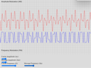
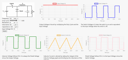
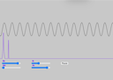
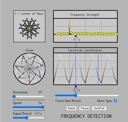
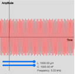
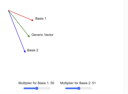
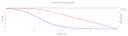
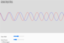

# Gallery

|     |     |     |     |
| --- | --- | --- | --- |
<<<<<<< HEAD
| [Analog Modulation]( ./sims/analog-mod/index.md)  | [Buck Converter]( ./sims/buck-converter/index.md)  | [Fast Fourier Trsnaform]( ./sims/fft/index.md)  | [Frequency Detection]( ./sims/frequency-detection/index.md)  |
| [LC-Oscillator]( ./sims/lc-oscillator/index.md)  | [Linear Algebra Sim]( ./sims/linear-algebra-sim/index.md)  | [Mobius Transform]( ./sims/mobius-transform/index.md)  | [MOSFET Biasing regions]( ./sims/mosfet-biasing/index.md)  |
| [RC Lowpass Filter]( ./sims/rc-lowpass-filter/index.md)  | [Time shifting and scaling]( ./sims/shift&scale/index.md)  |
=======
| [Analog Modulation]( ./sims/analog-mod/index.md)  | [Buck Converter]( ./sims/buck-converter/index.md)  | [Frequency Detection]( ./sims/frequency-detection/index.md)  | [LC-Oscillator]( ./sims/lc-oscillator/index.md)  |
| [Linear Algebra Sim]( ./sims/linear-algebra-sim/index.md)  | [Mobius Transform]( ./sims/mobius-transform/index.md)  | [MOSFET Biasing regions]( ./sims/mosfet-biasing/index.md)  | [RC Lowpass Filter]( ./sims/rc-lowpass-filter/index.md)  |
>>>>>>> 6eaf5b7... File renames, site map update for buck-converter deployment
