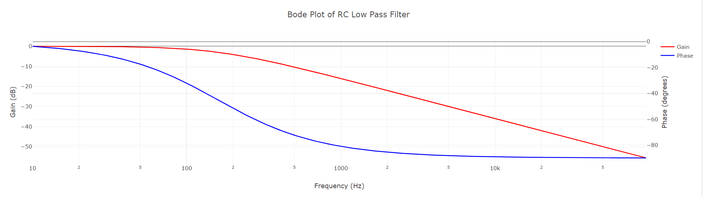

# RC Lowpass Filter

Creates a Bode Plot showing phase and magnitude for any inputted RC filter combination

<figure markdown>
   { width="400" }
</figure>

<form action="RCindex.html" style="text-align:center;">
<button style="align-content: center;" class="md-button md-button--primary">
</button>
</form>
