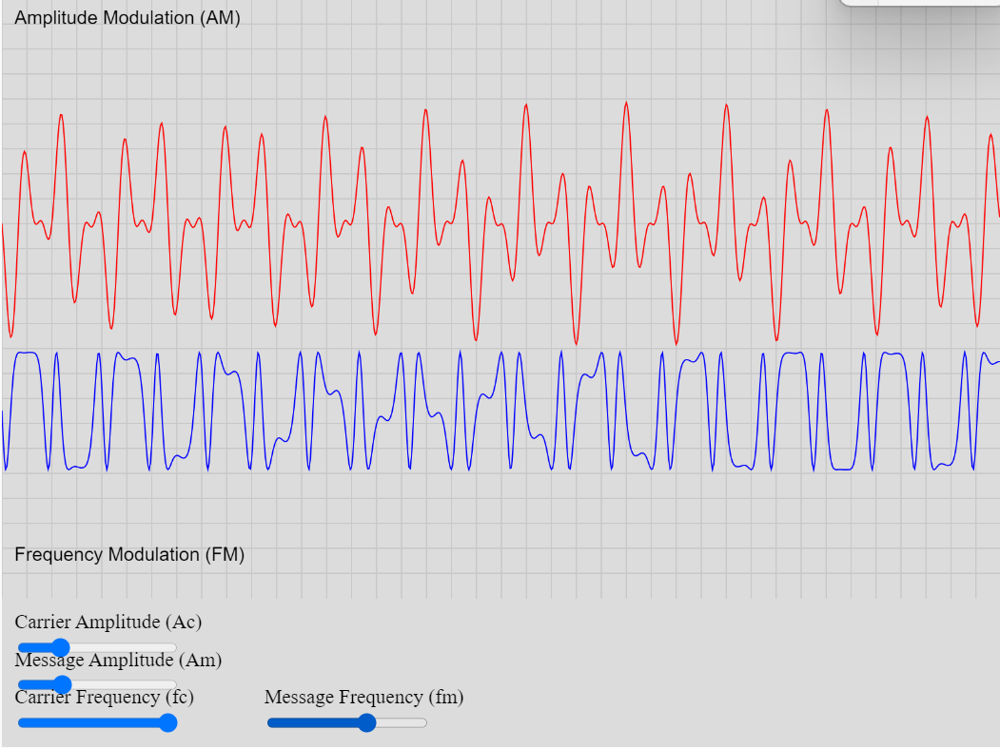

# Analog Modulation

<figure markdown>
   { width="400" }
   <figcaption>Analog Modulation Sim</figcaption>
</figure>

<form action="analog-mod.html" style="text-align:center;">
<button style="align-content: center;" class="md-button md-button--primary">
Run the Analog modulation MicroSim
</button>
</form>


## References

* [Analog modulation introduction](https://www.cdt21.com/design_guide/analogue-modulation/)

## Prompt

```linenums="0"
Develop a p5.js simulation that demonstrates analog modulation examples, focusing on amplitude or frequency modulation schemes. Incorporate sliders for adjusting variables such as Ac (amplitude of the carrier signal), Am (amplitude of the modulating signal), fc (frequency of the carrier signal), and fm (frequency of the modulating signal). Ensure the ranges for these variables are selected carefully to facilitate seamless interactivity.
```


