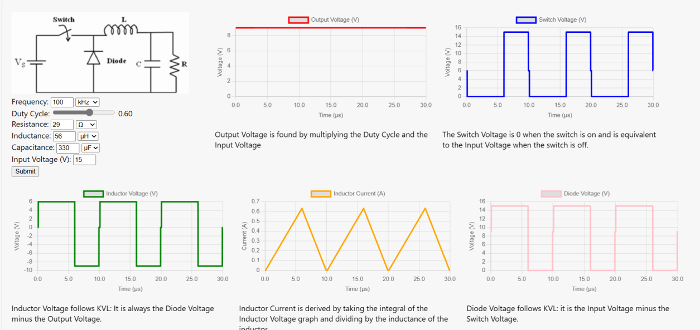

# Buck Converter

Creates various plots for any buck converter configuration the user inputs. Plots show inductor current and voltage, capacitor current and voltage, switch voltage, output voltage, and input current.

Image Source: 

<figure markdown>
   { width="400" }
</figure>

<form action="buck-converter.html" style="text-align:center;">
<button style="align-content: center;" class="md-button md-button--primary">Run the Buck Converter Simulation
</button>
</form>
