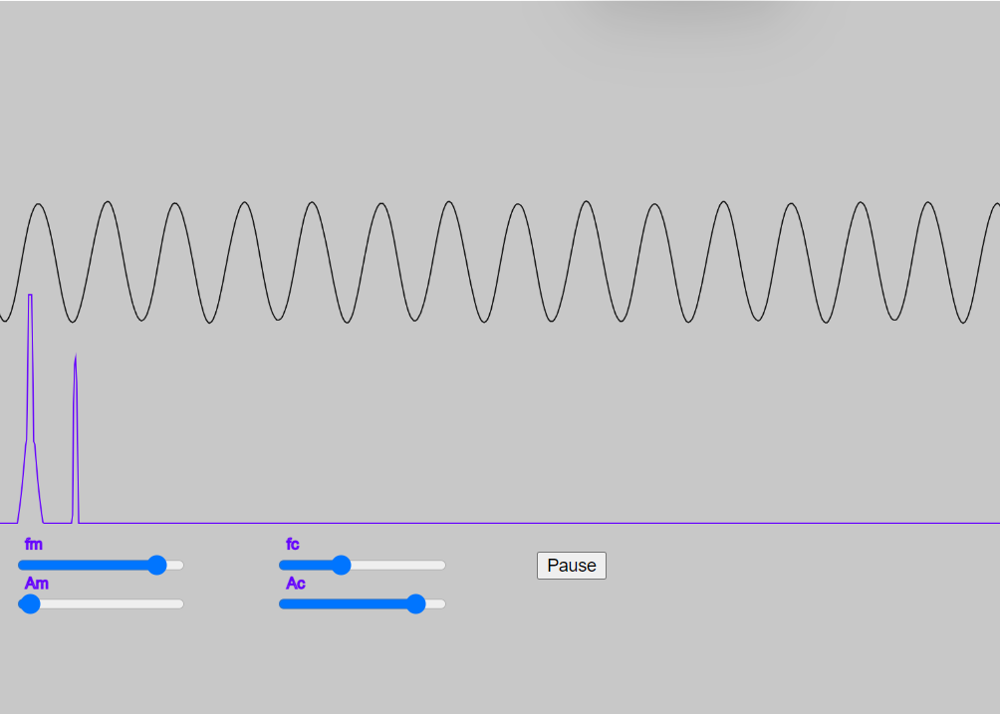

# Fast Fourier Trsnaform

<figure markdown>
   { width="400" }
   <figcaption>Fast Fourier transform Sim</figcaption>
</figure>

<form action="fft-scheme.html" style="text-align:center;">
<button style="align-content: center;" class="md-button md-button--primary">
Run the FFT MicroSim
</button>
</form>

FFT, or Fast Fourier Transform, is an algorithm designed to compute the Discrete Fourier Transform (DFT) and its inverse efficiently. The DFT is a mathematical transformation used to convert a signal from its original domain (often time or space) into a frequency domain. FFT is widely used because it reduces the complexity of computing the DFT from \(O(n^2)\) to \(O(n \log n)\), where \(n\) is the number of data points. This efficiency is critical in processing large datasets and in applications where real-time processing is required, such as audio signal processing, image analysis, and solving partial differential equations.

The key advantage of using FFT is that it helps in analyzing the frequency characteristics of signals, filtering, and managing signals in the frequency domain more effectively. It has numerous applications in engineering, physics, applied mathematics, and computer science, making it a fundamental tool in many scientific and engineering tasks.

