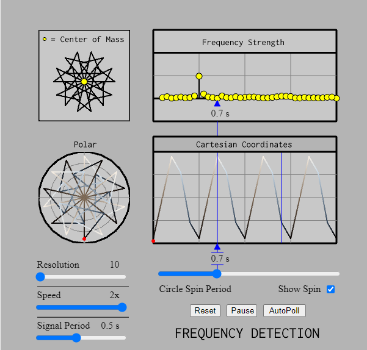

# Frequency Detection

<figure markdown>
   { width="400" }
   <figcaption>Frequency Detection MicroSim</figcaption>
</figure>

<form action="frequency-detection.html" style="text-align:center;">
<button style="align-content: center;" class="md-button md-button--primary">
Run the Frequency Detection MicroSim
</button>
</form>

