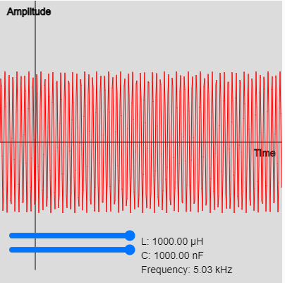

# LC-Oscillator

<figure markdown>
   { width="400" }
   <figcaption>LC Oscillator Sim</figcaption>
</figure>

<form action="lc-oscillator.html" style="text-align:center;">
<button style="align-content: center;" class="md-button md-button--primary">
Run the LC-Oscillator MicroSim
</button>
</form>

