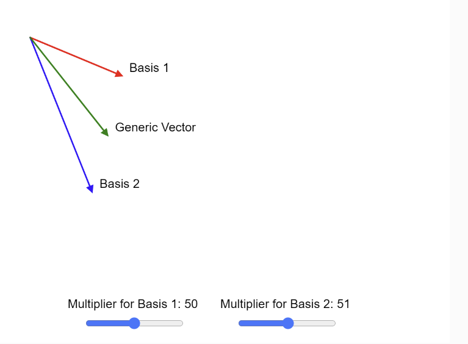

# Linear Algebra Sim

<figure markdown>
   { width="400" }
   <figcaption>Linear Algebra Sim</figcaption>
</figure>

Credit: Seungho

[Run the Linear Algebra sim](./linear-algebra-sim.html){ .md-button .md-button--primary }

[Edit the Linear Algebra sim](https://editor.p5js.org/durdru99/sketches/qqcPtvolz)

## Prompt
[ChatGPT dialog for Linear Algebra sim](https://chat.openai.com/share/347cffe8-6515-4bf7-8e04-1b6f7b648e38)
