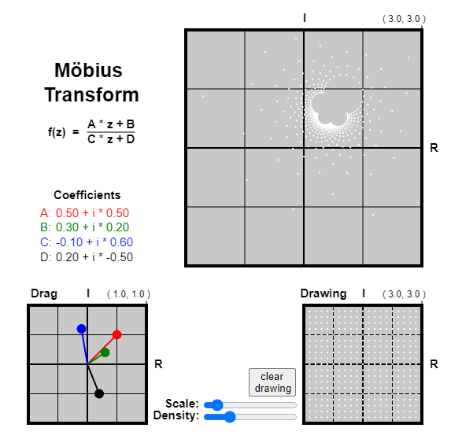

# Mobius Transform

<figure markdown>
   { width="400" }
</figure>

<form action="mobius-transform.html" style="text-align:center;">
<button style="align-content: center;" class="md-button md-button--primary">
Run the Mobius Transform MicroSim
</button>
</form>


## References

* [Mobius Transform Wikipedia](https://en.wikipedia.org/wiki/M%C3%B6bius_transformation)
* [Smith Chart and the Mobius Transform](https://cds.cern.ch/record/1417989/files/p95.pdf)
* [Desmos Implementation](https://www.desmos.com/calculator/61h3sc0err)

## Prompt

```linenums="0"
Create p5.js interactive script that allows the user to view and alter a mobius transform. 
Graph the coeffiecients as draggable vectors, and display a point domain of configurable scale and density.
Create a user drawable side canvas, map the drawn points back through the transform and displays it alongside the current point map visualization.
```
* [ChatGPT conversation history](https://chat.openai.com/share/10214b86-450e-4dad-80b5-a5c318652146)

