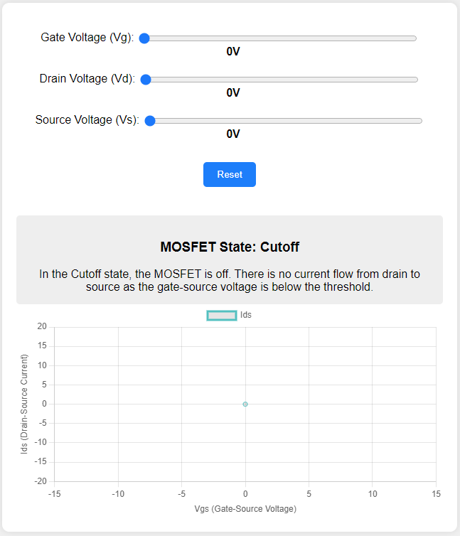

# MOSFET Biasing regions

<figure markdown>
   { width="400" }
</figure>

<form action="mosfet-biasing.html" style="text-align:center;">
<button style="align-content: center;" class="md-button md-button--primary">
Run the MOSFET Amplifier Biasing Microsim
</button>
</form>


## References

* [MOSFET Amplifier Information](https://www.simonfoucher.com/McGill/ECSE330%20Electronics/Notes/4.4%20MOSFETS%20in%20IC%20CSA%20CGA.pdf)
* [Regions of a MOSFET Amp](https://www.circuitbread.com/tutorials/what-are-the-different-regions-of-operation-for-a-fet)

## Prompt

```linenums="0"
I want you to create a simulation that teaches the fundamental functionality of a MOSFET based amplifier. The simulation would be best if it contained multiple buttons and sliders to modify the inputs of the simulation.

There needs to be information relating to each of the amplifier states. When the amplifier is is one of the states an information box needs to appear that describes what is going on in that current state. 

To add more educational value we need to have a graph that shows where the different regions occur. I need you to add a graph that shows where the different states occur and what values they occur at.
```
* [ChatGPT conversation history](https://chat.openai.com/share/231ac166-0ff3-4272-9809-2a11eca77875)

