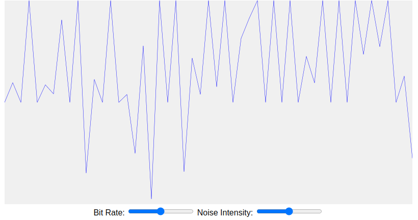

# Noise Simulation

<figure markdown>
   { width="400" }
</figure>
<form action="noise.html" style="text-align:center;">
<button style="align-content: center;" class="md-button md-button--primary">
Run the Noise Simulation MicroSim
</button>
</form>

