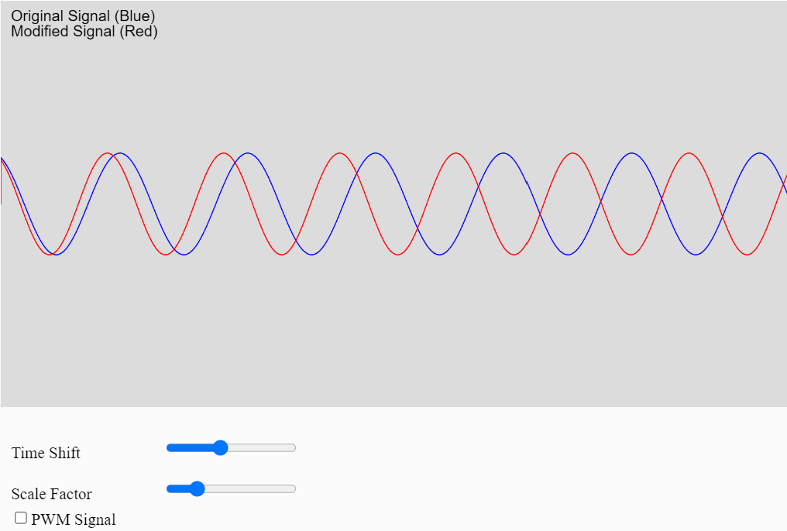

# Time shifting and scaling

Signal time shifting and scaling are key operations in signal processing:

**Time Shifting** moves a signal forward or backward in time:
- \( x(t) \rightarrow x(t - t_0) \)
- Shifting right (\( t_0 > 0 \)) delays the signal.
- Shifting left (\( t_0 < 0 \)) advances the signal.

**Time Scaling** changes the speed at which a signal occurs:
- \( x(t) \rightarrow x(at) \)
- \( a > 1 \): compresses the signal, making it faster.
- \( 0 < a < 1 \): stretches the signal, making it slower.

Time shifting affects when a signal occurs, while time scaling alters how quickly it happens, impacting its frequency characteristics.

<figure markdown>
   { width="400" }
   <figcaption>Shift & Scale Sim</figcaption>
</figure>

<form action="shiftscale.html" style="text-align:center;">
<button style="align-content: center;" class="md-button md-button--primary">
Run the Shift and scale MicroSim
</button>
</form>

